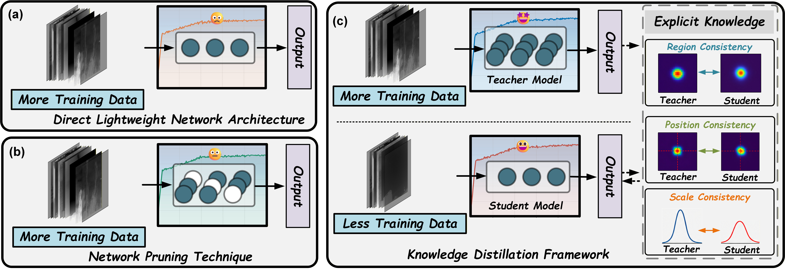
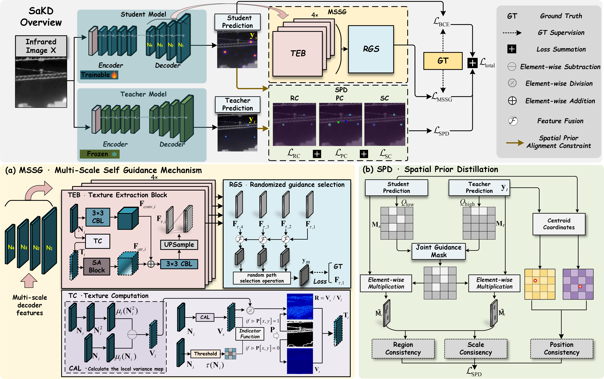

# SaKD: Lightweight Infrared Small Target Detection via Spatial-Aware Knowledge Distillation for Edge Deployment

**Qianwen Ma**, **Shangwei Deng**, **Ruoqi Lian**, **Zhen Zhu**, **Haofeng Hu**, **Xiaobo Li***

Tianjin University

* Corresponding author

---

## 📦 Code Availability

Thank you for your interest in our work. We will release the code after the paper is accepted.

---

## 🔥 News

- **[2026.08] Current Status: ISPRS R1!**

---

## 📌 Overview

SaKD is a spatial-aware knowledge distillation framework for lightweight infrared small target detection and efficient edge deployment. It transfers explicit spatial knowledge from a high-capacity teacher model to a lightweight student model through region, position, and scale consistency.

  

<em>Motivation of the proposed knowledge distillation framework.</em>

---

## 🏗️ Framework

The proposed SaKD framework consists of two principal components:

- **Multi-Scale Self Guidance Mechanism (MSSG):** 
- **Spatial Prior Distillation (SPD):** 

  

<em>Overview of the proposed SaKD framework: (a) MSSG and (b) SPD.</em>

---

## 📖 Citation

The citation information will be updated after the paper is accepted.

---

## 🙏 Acknowledgements

Thank you for your interest in SaKD and infrared small target detection.

